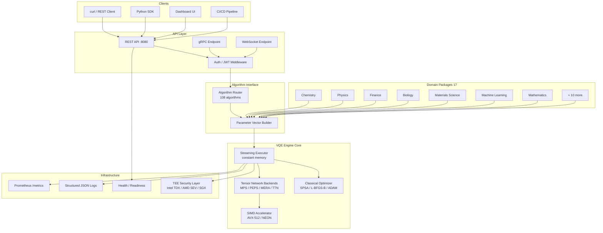

# Architecture Overview

Nawaz1 is a unified quantum computing engine that routes every computation through a single VQE (Variational Quantum Eigensolver) execution substrate. This page explains how the components fit together.

---

## System Diagram



---

## Component Breakdown

### 1. Client Layer

Users interact with Nawaz1 through any HTTP client. The API is a standard RESTful JSON interface, with optional gRPC and WebSocket support for streaming results.

| Client | Use Case |
|--------|---------|
| `curl` | Quick testing, scripting, CI/CD |
| Python SDK (`requests`/`nawaz1-sdk`) | Application integration, data science workflows |
| Dashboard UI | Visual monitoring and ad-hoc queries |
| CI/CD pipeline | Serverless one-shot mode in GitHub Actions, Jenkins, etc. |

### 2. API Layer

The server exposes three protocol endpoints, all backed by the same execution engine:

| Endpoint | Protocol | When to Use |
|----------|---------|------------|
| `POST /api/v1/quantum/execute` | REST (HTTP/JSON) | Most workloads; stateless, idempotent |
| gRPC service | gRPC/protobuf | High-throughput, binary streaming |
| WebSocket `/ws` | WS/JSON | Real-time result streaming, long-running jobs |

All endpoints pass through JWT authentication middleware (configurable; optional in development).

**Key endpoints:**

| Path | Purpose |
|------|---------|
| `GET /api/v1/health` | Liveness probe |
| `GET /api/v1/ready` | Readiness probe (traffic routing) |
| `GET /api/v1/version` | Build metadata |
| `GET /metrics` | Prometheus scrape endpoint |
| `POST /api/v1/quantum/execute` | Main computation endpoint |

### 3. Algorithm Interface

This is the key architectural insight: **all 108 algorithms share a single execution path**.

The `algorithm` field in the request (e.g. `"vqe"`, `"qaoa"`, `"hhl"`, `"grover"`) does not select a different code path. Instead it selects how the input data is interpreted and mapped onto the unified VQE parametric circuit. Only the parameter vector changes.

```
Request arrives
  -> Algorithm Router reads `algorithm` field
  -> Parameter Vector Builder constructs the problem-specific parameter vector
  -> Single VQE circuit executes with that parameter vector
  -> Result returned
```

This means adding a new algorithm requires no new execution code — only a new parameter mapping rule.

### 4. VQE Engine Core

The engine is the computational heart of Nawaz1, written in Rust for performance and safety.

| Component | Role |
|-----------|------|
| **Streaming Executor** | Processes input in chunks, holding at most ~2 MB in RAM at any time regardless of input size |
| **Tensor Network Backends** | MPS (Matrix Product States), PEPS, MERA, TTN — selected automatically based on entanglement structure (in superposition) |
| **SIMD Accelerator** | AVX-512/AVX2 on x86_64, NEON on ARM64 — vectorized gate and tensor operations |
| **Classical Optimizer** | SPSA, L-BFGS-B, ADAM, CMA-ES, QNG, Rotosolve, Nelder-Mead — drives the variational loop |

**Execution model:**

1. Input amplitudes arrive (potentially millions)
2. Streaming executor reads them in chunks of ~2 MB
3. Each chunk is processed through the tensor network
4. Accumulator state is updated; chunk memory is freed
5. Final energy, fidelity, and convergence metrics are returned

This gives **constant memory usage** regardless of problem size — a 65,536-qubit hemoglobin simulation uses the same RAM as a 4-qubit H2 molecule.

### 5. Domain Packages (17)

Each package specializes the parameter vector builder for a particular scientific domain:

| Package | Specialization |
|---------|---------------|
| **Chemistry** | Molecular Hamiltonians, orbital energies, basis sets (STO-3G to cc-pVTZ) |
| **Physics** | Heisenberg/Ising models, time evolution, many-body systems |
| **Finance** | Portfolio weights, risk matrices, Monte Carlo payoffs |
| **Biology** | Protein folding energies, biomolecular interactions |
| **Materials Science** | Crystal structures, band structures, phonon dispersions |
| **Machine Learning** | Feature amplitudes, kernel matrices, QNN parameters |
| **Mathematics** | Sparse matrix entries, linear system coefficients |
| **Fluid Mechanics** | Navier-Stokes grid data, turbulence parameters |
| **+ 9 more** | See [docs/INDEX.md](INDEX.md#domain-packages) for the full list |

Each package has its own README at `packages/<domain>/README.md` with complete API examples.

### 6. Infrastructure Layer

Production-grade observability and security are built in, not bolted on:

| Capability | Implementation |
|-----------|---------------|
| **Metrics** | Prometheus-compatible `/metrics` endpoint (qubits in use, memory, latency histograms) |
| **Logging** | Structured JSON logs with configurable levels; rotated file output |
| **Health probes** | Separate liveness (`/health`) and readiness (`/ready`) endpoints for Kubernetes |
| **Security** | AES-GCM-256 encryption at rest; optional TEE hardware acceleration (Intel TDX, AMD SEV, SGX) |
| **Authentication** | JWT tokens + API key middleware |
| **Crash recovery** | Graceful shutdown on SIGTERM/SIGINT; worker thread panic isolation |

---

## Execution Modes

Nawaz1 runs in two modes, selected by environment variable:

### Server Mode (default)

Long-running process exposing REST, gRPC, and WebSocket endpoints. Suitable for production APIs, dashboards, and multi-user environments.

```bash
./bin/x86_64/nawaz1-server
# Listens on 0.0.0.0:8080
```

### Serverless Mode

Single-shot execution: read a JSON request, compute, print result, exit. No network listeners, no auth. Ideal for scripts, CI/CD pipelines, and batch jobs.

```bash
NAWAZ1_MODE=serverless NAWAZ1_INPUT_FILE=request.json ./bin/x86_64/nawaz1-server
# Prints JSON result to stdout and exits
```

---

## Data Flow

A typical request flows through the system as follows:

```
1. Client sends POST /api/v1/quantum/execute with JSON payload
2. Auth middleware validates JWT / API key
3. Algorithm Router reads `algorithm` and `domain` fields
4. Domain Package constructs the problem-specific parameter vector
5. Parameter Vector Builder maps it to the unified VQE circuit parameters
6. Streaming Executor processes input amplitudes in ~2 MB chunks
7. Tensor Network Backend computes energy via variational optimization
8. Classical Optimizer drives convergence (single pass for structured data)
9. Result (energy, fidelity, convergence) serialized to JSON
10. Response returned to client
```

---

## Deployment Topologies

| Topology | Components | Scale |
|----------|-----------|-------|
| **Standalone** | Single binary on Linux box | Development, small teams |
| **Docker** | Containerized binary + Docker Compose | Local/CI/CD, single-node production |
| **Kubernetes** | Deployment + Service + HPA + ConfigMap | Multi-node, auto-scaling production |
| **Systemd** | Native binary as system service | Bare-metal production, minimal overhead |

See the [Deployment section in README](../README.md#deployment) for configuration details for each topology.

---

## Key Design Decisions

| Decision | Rationale |
|----------|----------|
| Single unified VQE circuit for all algorithms | Eliminates code duplication; adding algorithms requires only a parameter mapping |
| Streaming execution with ~2 MB chunks | Constant memory for arbitrarily large problems |
| Rust implementation | Memory safety without garbage collection; zero-cost abstractions |
| Binary-only distribution | Protects IP; no source-code dependency leakage |
| TEE-optional security | Works on any CPU; hardware security is bonus, not a requirement |
| Domain packages as data mappers | Clean separation of domain logic from execution engine |

---

## Next Steps

- [Quick Start](QUICKSTART.md) — Run your first computation
- [Benchmarks](BENCHMARKS.md) — Reference performance figures
- [Tutorials](INDEX.md#tutorials) — Step-by-step domain walkthroughs
- [Main README](../README.md) — Full API reference and configuration
